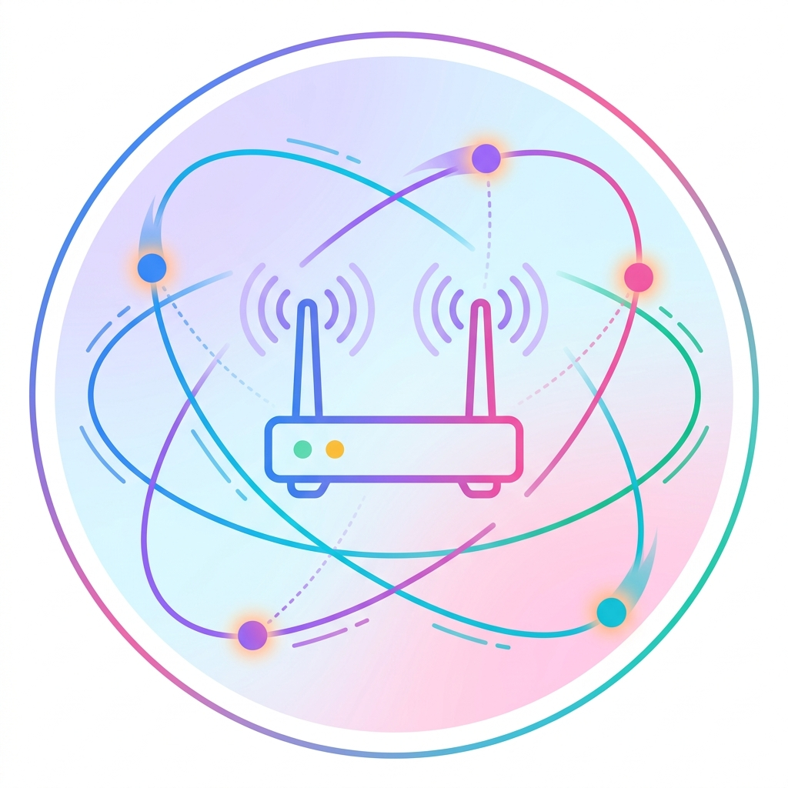

<p align="center">
  
</p>

# Awesome Network Engineering Agent

[](https://awesome.re)

A curated list of papers, benchmarks, and tools for AI agents in network engineering.

> Network Engineering Agents are AI systems that autonomously understand network intent, interact with network environments, generate configurations or optimization decisions, and verify outcomes through closed-loop feedback.

---

## News

**[2026/04/16]** We release the initial version of Awesome Network Engineering Agent!

**[2026/04/16]** We successfully reproduced [NetArena](https://github.com/Froot-NetSys/NetArena) (ICLR 2026) MALT benchmark with Qwen3.5-Flash.

---

## Table of Contents

- [1. What is a Network Engineering Agent?](#1-what-is-a-network-engineering-agent)
  - [1.1 Definition](#11-definition)
  - [1.2 Application Domains](#12-application-domains)
  - [1.3 From Traditional Automation to Agentic AI](#13-from-traditional-automation-to-agentic-ai)
  - [1.4 Comparison with Software Engineering Agent](#14-comparison-with-software-engineering-agent)
- [2. How to Build?](#2-how-to-build)
  - [2.1 Data-Driven](#21-data-driven)
  - [2.2 Scaffold-Driven](#22-scaffold-driven)
  - [2.3 Environment-Driven](#23-environment-driven)
- [3. How to Scale?](#3-how-to-scale)
  - [3.1 Scaling with RL](#31-scaling-with-rl)
  - [3.2 Scaling with Tools](#32-scaling-with-tools)
  - [3.3 Scaling with Skills](#33-scaling-with-skills)
  - [3.4 Scaling with Memory](#34-scaling-with-memory)
- [4. How to Evaluate?](#4-how-to-evaluate)
  - [4.1 Static Benchmarks](#41-static-benchmarks)
  - [4.2 Dynamic Benchmarks](#42-dynamic-benchmarks)
- [Contributing](#contributing)

---

## 1. What is a Network Engineering Agent?

### 1.1 Definition

A Network Engineering Agent is an AI system that autonomously performs network engineering tasks by understanding natural language intent, observing network state, generating actions (code, commands, configurations), executing them in the network environment, and verifying outcomes.

```
Intent (natural language)  +  Network State
              |                     |
              v                     v
        Agent: Understand goal + Read environment
              |
              v
        Generate action (code / command / config)
              |
              v
        Execute in network environment
              |
              v
        Verify: correctness + safety + performance
```

### 1.2 Application Domains

Network engineering agent tasks fall into three categories: **Configuration** (translating intent into device-level settings), **Optimization** (tuning resource allocation and physical-layer parameters), and **Operations** (diagnosing faults, generating simulations, and managing knowledge). The detailed task landscape with paper coverage is in [Section 2.4](#24-network-engineering-task-landscape).

### 1.3 From Traditional Automation to Agentic AI

| Generation | Approach | Limitation |
|-----------|----------|------------|
| CLI Scripts | Vendor-specific commands, manual templates | No flexibility, no understanding |
| Intent-Based Networking (IBN) | Declarative policies, predefined templates | Limited to pre-designed intent types |
| LLM-Assisted | Natural language to config (single-turn) | No iteration, no verification |
| **Agentic AI** | **Autonomous multi-turn loop: observe, reason, act, verify** | **Current frontier** |

### 1.4 Comparison with Software Engineering Agent

| Dimension | Software Engineering Agent | Network Engineering Agent |
|-----------|--------------------------|--------------------------|
| Representative | SWE-Agent, Devin, OpenHands | Intent-LLM, MeshAgent, WirelessAgent |
| Benchmark | SWE-Bench, BeyondSWE | NetArena, NetLLMBench |
| Task | Fix bugs in source code | Configure/optimize/diagnose networks |
| Environment | Code repository + test suite | Network simulator/emulator + live traffic |
| Verification | Compile + unit tests pass | Connectivity + SLA + safety constraints |
| Domain knowledge | Programming languages, APIs | 3GPP specs, routing protocols, PHY models |
| Maturity | Rapidly advancing | Early stage |

---

## 2. How to Build?

The three approaches are distinguished by where the agent's capability comes from: **from data** (model weights are changed), **from scaffolding** (model weights are frozen, capability comes from framework design), or **from environment interaction** (capability comes from closed-loop feedback).

### 2.1 Data-Driven

Building domain capability through pretraining, fine-tuning, or distillation. Model weights are modified.

| Paper | Venue | Method | Code |
|-------|-------|--------|------|
| [NetLLM](https://github.com/duowuyms/NetLLM) | SIGCOMM 2024 | LoRA fine-tuning LLaMA-2 for networking tasks (viewport, ABR, scheduling) | [GitHub](https://github.com/duowuyms/NetLLM) |
| [Tele-LLMs](https://github.com/Ali-maatouk/Tele-LLMs) | arXiv 2024 | 1B-8B LLMs continually pretrained on 3GPP/arXiv telecom data | [GitHub](https://github.com/Ali-maatouk/Tele-LLMs) |
| [Mobile-LLaMA](https://github.com/DNLab2024/Mobile-LLaMA) | IEEE Network 2024 | Instruction fine-tuned LLaMA-2 13B for 5G network analysis | [GitHub](https://github.com/DNLab2024/Mobile-LLaMA) |
| TelecomGPT | arXiv 2024 | Continual pretraining + SFT + RLHF on OpenTelecom dataset | - |
| [BiAn](https://dl.acm.org/doi/10.1145/3718958.3750505) | SIGCOMM 2025 | LLM-based failure localization, 95.5% accuracy at Alibaba Cloud | - |
| [NetAssistant](https://www.usenix.org/conference/nsdi24/presentation/wang-haopei) | NSDI 2024 | Dialogue-based network diagnosis deployed at ByteDance 3+ years | - |

### 2.2 Scaffold-Driven

Building agent capability through framework design on top of frozen models. Capability comes from prompting, tool integration, multi-agent orchestration, and code generation.

| Paper | Venue | Method | Code |
|-------|-------|--------|------|
| [Confucius](https://dl.acm.org/doi/10.1145/3718958.3750537) | SIGCOMM 2025 | Multi-agent LLM + DAG planning + RAG, deployed at Meta | - |
| [MeshAgent](https://zaoxing.github.io/papers/2026/SIGMETRICS26_MeshAgent.pdf) | SIGMETRICS 2026 | Constraint-guided generation with domain-specific invariants | - |
| [WirelessAgent](https://github.com/jwentong/WirelessAgent_R1) | arXiv 2024 | Perception-memory-planning-action framework for wireless tasks | [GitHub](https://github.com/jwentong/WirelessAgent_R1) |
| [INTA](https://arxiv.org/abs/2501.08760) | IEEE ICNP 2025 | Intent-based RAG for cross-vendor config translation, 98.15% syntactic correctness | - |
| [Clarify](https://conferences.sigcomm.org/hotnets/2025/papers/hotnets25-final189.pdf) | HotNets 2025 | Interactive disambiguation for ACL/route-map synthesis | - |
| [MNC](https://www.sciencedirect.com/science/article/pii/S2667305325000572) | Elsevier 2025 | Three-module multi-agent with CoT and reflection | - |
| [Hermes](https://arxiv.org/abs/2411.06490) | arXiv 2024 | Digital twin + multi-model orchestration for autonomous networks | - |
| [Intent-LLM](https://ieeexplore.ieee.org/document/11169296/) | IEEE TCCN 2025 | Structured 4-round prompting + API-defined action space (VipeeGPT) | - |

### 2.3 Environment-Driven

Building agent capability through closed-loop interaction with network simulators, emulators, or digital twins. Capability comes from environmental feedback and iterative refinement.

| Paper | Venue | Method | Code |
|-------|-------|--------|------|
| [GenOnet](https://github.com/frezazadeh/LangChain-RAG-Technology) | IEEE 6GNet 2024 | Multi-agent NL-to-ns-3 code generation with RAG | [GitHub](https://github.com/frezazadeh/LangChain-RAG-Technology) |
| [Generative 6G Sim](https://arxiv.org/abs/2503.13402) | IEEE ICC 2025 | Extended GenOnet for 5G/6G with 5G-LENA validation | [GitHub](https://github.com/frezazadeh/LangChain-RAG-Technology) |
| [6GAgentGym](https://arxiv.org/abs/2603.29656) | arXiv 2026 | 42 typed tools + NS-3 calibrated env + SFT/RL closed-loop training, 8B matches GPT-5 | - |

### 2.4 Network Engineering Task Landscape

What tasks are being studied, and by whom?

#### Network Configuration

| Task | Papers |
|------|--------|
| Routing config (BGP/OSPF/static) | NetLLM, Confucius, INTA, MNC, NetLLMBench, NetArena, 6GAgentGym |
| Cross-vendor config translation | INTA, Clarify |
| Intent-to-config translation | Intent-LLM, Clarify, NetConfEval |
| ACL / firewall policy | Clarify, NetConfEval |
| Network slicing config | WirelessAgent, ORAN-GUIDE, ReLLM, 6GAgentGym |

#### Network Optimization

| Task | Papers |
|------|--------|
| Resource allocation | WirelessAgent, ReLLM, 6GAgentGym, WirelessBench |
| Beamforming / PHY optimization | ComAgent, LAM4PHY_6G, WirelessBench |
| Capacity planning | MeshAgent, NetArena (MALT) |
| Spectrum management | BLAST |
| Energy efficiency | Intent-LLM |

#### Network Operations

| Task | Papers |
|------|--------|
| Fault diagnosis / troubleshooting | BiAn, NetAssistant, MeshAgent, LLM4NetLab, NetArena (Route) |
| Network simulation code generation | GenOnet, Generative 6G Sim, SIMCODE |
| Digital twin construction | Hermes |
| Telecom knowledge QA | Tele-LLMs, TelecomGPT, Telco-RAG, TelecomRAG, Mobile-LLaMA |
| K8s / cloud-native networking | NetArena (K8s) |

---

## 3. How to Scale?

### 3.1 Scaling with RL

Reinforcement learning in network environments to improve agent policies.

| Paper | Venue | Method | Code |
|-------|-------|--------|------|
| [Agent-R1](https://github.com/0russwest0/Agent-R1) | arXiv 2025 | End-to-end RL (PPO/GRPO) for multi-turn tool-calling agents | [GitHub](https://github.com/0russwest0/Agent-R1) |
| [AgentGym-RL](https://github.com/WooooDyy/AgentGym-RL) | arXiv 2025 | Staged RL training across diverse environments | [GitHub](https://github.com/WooooDyy/AgentGym-RL) |
| [ComAgent](https://github.com/jiangfeibo/ComAgent) | arXiv 2026 | Multi-LLM agentic framework with closed-loop for beamforming | [GitHub](https://github.com/jiangfeibo/ComAgent) |
| [ORAN-GUIDE](https://arxiv.org/abs/2506.00576) | arXiv 2025 | Dual-LLM + RAG-enhanced multi-agent RL for O-RAN slicing | - |
| [LLM-xApp](https://arxiv.org/abs/2501.08760) | NDSS FutureG 2025 | LLM-powered xApp for adaptive radio resource management | - |

### 3.2 Scaling with Tools

Expanding agent capabilities through external tools and APIs.

| Paper | Venue | Method | Code |
|-------|-------|--------|------|
| [Confucius](https://dl.acm.org/doi/10.1145/3718958.3750537) | SIGCOMM 2025 | 60+ network management tools integrated via multi-agent LLM | - |
| [WirelessAgent](https://github.com/jwentong/WirelessAgent_R1) | arXiv 2024 | Four-module cognitive architecture with external knowledge base | [GitHub](https://github.com/jwentong/WirelessAgent_R1) |
| [BLAST](https://arxiv.org/abs/2604.12127) | arXiv 2026 | LLM agents + blockchain for autonomous spectrum trading | - |
| [LAM4PHY_6G](https://github.com/AI4Wireless/LAM4PHY_6G) | Various IEEE 2024-25 | GPT-2 adapted for CSI feedback, beam prediction, multi-task PHY | [GitHub](https://github.com/AI4Wireless/LAM4PHY_6G) |
| [Intent-LLM](https://ieeexplore.ieee.org/document/11169296/) | IEEE TCCN 2025 | API-defined action space constraining agent to valid operations | - |

### 3.3 Scaling with Skills

Accumulating reusable operation skills across tasks.

| Paper | Venue | Method | Code |
|-------|-------|--------|------|
| [Voyager](https://github.com/MineDojo/Voyager) | NeurIPS 2023 | First LLM agent with ever-growing executable skill library | [GitHub](https://github.com/MineDojo/Voyager) |
| [SkillRL](https://github.com/aiming-lab/SkillRL) | arXiv 2026 | Hierarchical skill bank with recursive skill evolution via RL | [GitHub](https://github.com/aiming-lab/SkillRL) |
| [SAGE](https://arxiv.org/abs/2512.17102) | arXiv 2025 | Skill-Augmented GRPO for self-evolution, 8.9% higher goal completion | - |
| [PAE](https://yanqval.github.io/PAE/) | arXiv 2024 | Autonomous skill discovery with VLM-based success evaluation as reward | [GitHub](https://yanqval.github.io/PAE/) |
| [SkillWeaver](https://arxiv.org/abs/2504.07079) | arXiv 2025 | Web agents self-discover and synthesize reusable skill APIs | - |

### 3.4 Scaling with Memory

Enabling agents to accumulate and reuse experience across tasks.

| Paper | Venue | Method | Code |
|-------|-------|--------|------|
| [A-MEM](https://github.com/agiresearch/A-mem) | NeurIPS 2025 | Zettelkasten-style self-organizing memory with dynamic indexing | [GitHub](https://github.com/agiresearch/A-mem) |
| [TelecomRAG](https://dl.acm.org/doi/10.1145/3656296) | SIGCOMM CCR 2025 | RAG framework optimized for 3GPP Release 16/18 documents | - |
| [Telco-RAG](https://github.com/netop-team/Telco-RAG) | arXiv 2024 | Dual-stage RAG with custom telecom glossary for 3GPP | [GitHub](https://github.com/netop-team/Telco-RAG) |
| [ReLLM](https://arxiv.org/abs/2511.22933) | arXiv 2025 | RAG-empowered LLM for dynamic radio resource management in O-RAN | - |
| [EvolveR](https://arxiv.org/abs/2510.16079) | arXiv 2025 | Self-evolving agents via offline self-distillation of experience | - |

---

## 4. How to Evaluate?

### 4.1 Static Benchmarks

Fixed test sets for reproducible evaluation.

| Benchmark | Venue | Tasks | Scale |
|-----------|-------|-------|-------|
| [NetLLMBench](https://github.com/tum-lkn/netllmbench) | IEEE 2025 | BGP/OSPF/static route config | Fixed configs |
| [LLM4NetLab](https://github.com/zhihao1998/LLM4NetLab) | SIGCOMM 2025 | Fault diagnosis | Curated incidents |
| [SIMCODE](https://arxiv.org/abs/2507.11014) | arXiv 2025 | NL to ns-3 code generation | 400 tasks, 3 levels |
| [NetConfEval](https://github.com/NetConfEval/NetConfEval) | CoNEXT 2024 | 4 config tasks, runner-up best paper | [GitHub](https://github.com/NetConfEval/NetConfEval) |
| [WirelessBench](https://wirelessbench.github.io/) | arXiv 2026 | Tolerance-aware, 3392 items, 3 cognitive tiers | [GitHub](https://github.com/jwentong/WirelessBench) |

### 4.2 Dynamic Benchmarks

Runtime-generated queries to avoid data contamination.

| Benchmark | Venue | Tasks | Key Feature |
|-----------|-------|-------|-------------|
| [NetArena](https://github.com/Froot-NetSys/NetArena) | ICLR 2026 | Route, MALT, K8s | Dynamic query generation, A2A protocol, 3-metric evaluation |
| [6GAgentGym](https://arxiv.org/abs/2603.29656) | arXiv 2026 | 6G network management | 42 tools, NS-3 calibrated env, closed-loop RL |

---

## Contributing

We welcome contributions! Please see [CONTRIBUTING.md](CONTRIBUTING.md) for guidelines.

To add a paper:
1. Find the appropriate section
2. Add an entry with: title, venue, year, and a one-line description
3. Submit a pull request

---

## Citation

If you find this resource useful, please cite:

```bibtex
@misc{awesome-network-engineering-agent,
  title={Awesome Network Engineering Agent},
  author={tenderzada and contributors},
  year={2026},
  url={https://github.com/tenderzada/awesome-network-engineering-agent}
}
```

---

## Star History

<a href="https://star-history.com/#tenderzada/awesome-network-engineering-agent&Date">
 <picture>
   <source media="(prefers-color-scheme: dark)" srcset="https://api.star-history.com/svg?repos=tenderzada/awesome-network-engineering-agent&type=Date&theme=dark" />
   <source media="(prefers-color-scheme: light)" srcset="https://api.star-history.com/svg?repos=tenderzada/awesome-network-engineering-agent&type=Date" />
   
 </picture>
</a>
